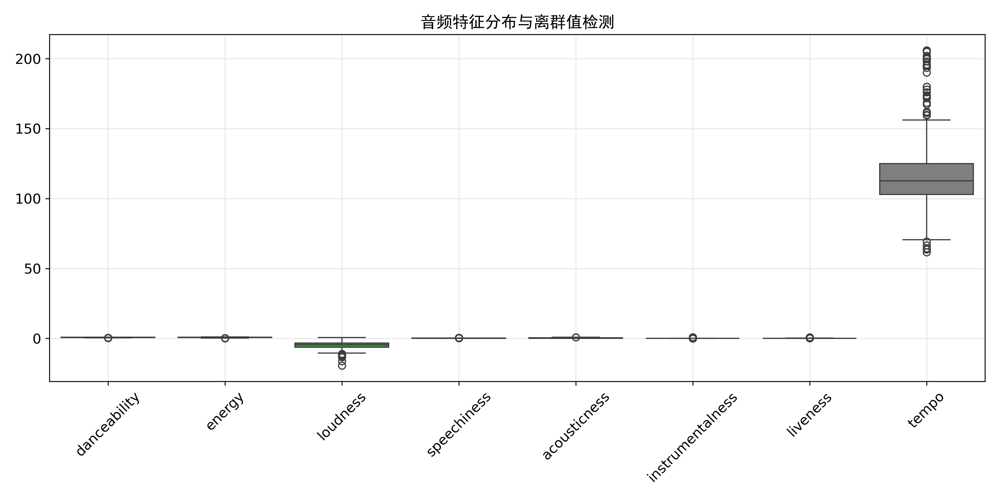
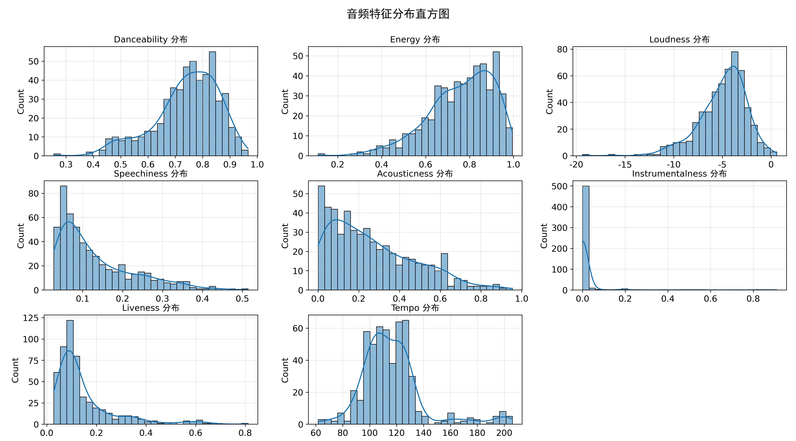
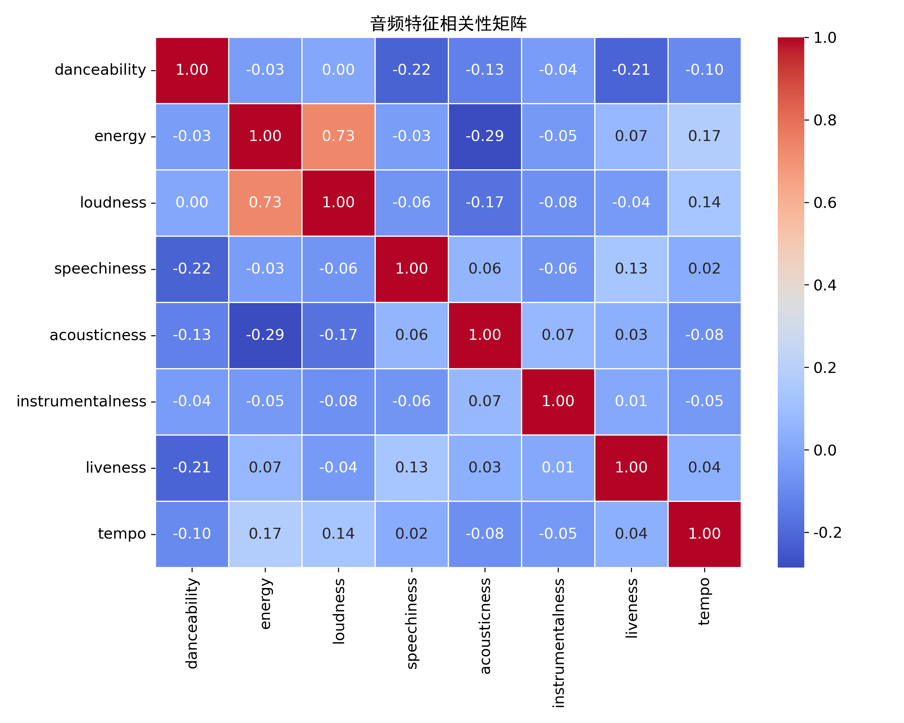
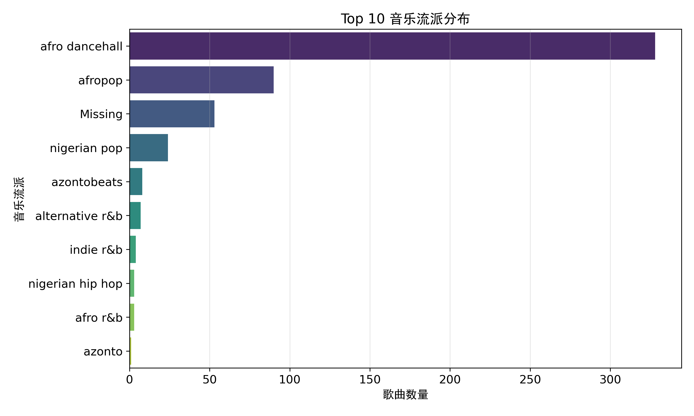
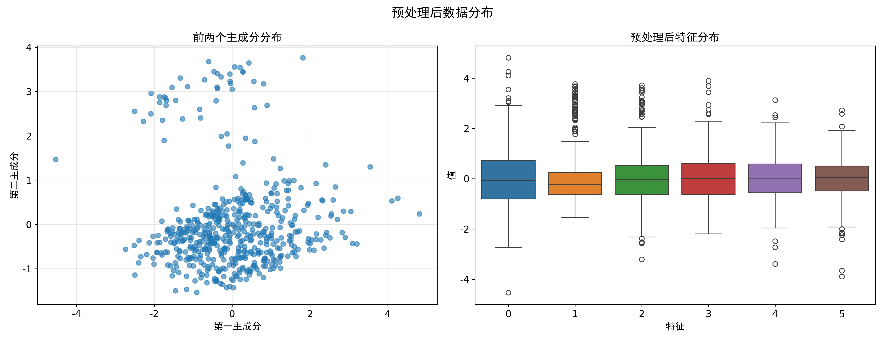
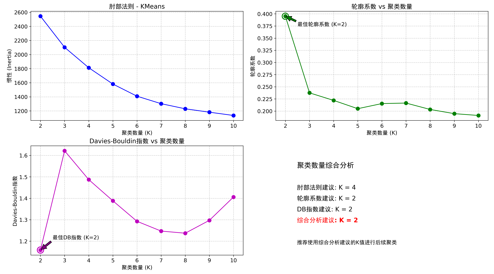
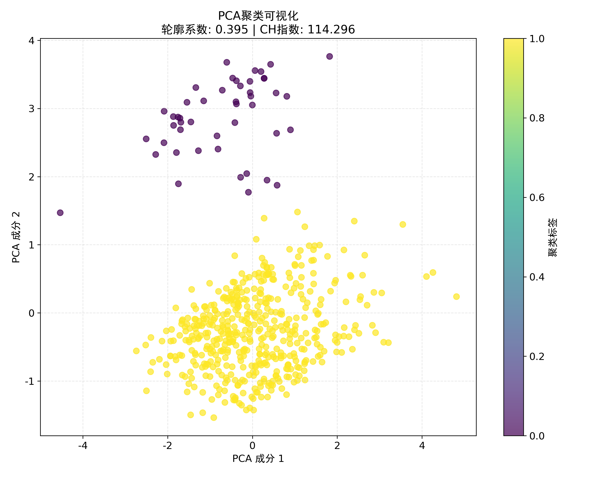
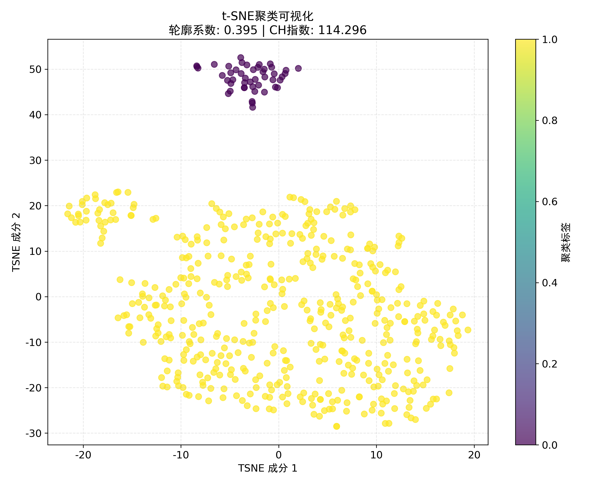
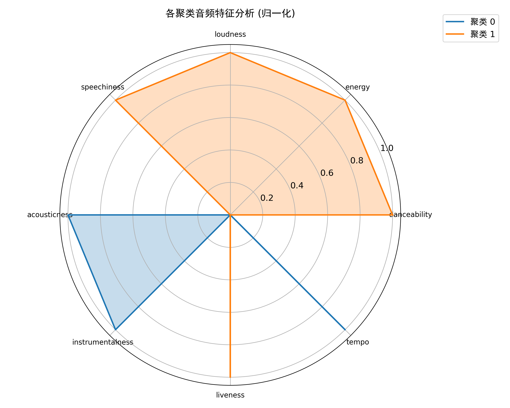
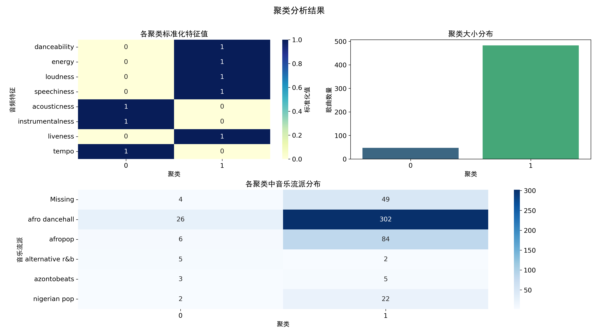

# 尼日利亚观众音乐品味的聚类分析

## 一，数据描述

1.name歌曲名称

2.album专辑名称

3.artist歌手/乐队。

4.artist_top_genre音乐类型（如 Afropop、Nigerian Pop）。

5.release_date发行日期

6.length歌曲的总长度，单位为毫秒。

7.popularity歌曲受欢迎程度（0-100，值越高越受欢迎）。

8.danceability 可舞性（0.0-1.0，值越高越适合跳舞）

9.acousticness 原声度（0.0-1.0，值越高表示原声乐器越多）

10.energy 能量强度（0.0-1.0，值越高歌曲越激烈）

11.instrumentalness 乐器性（0.0-1.0，值越高代表人声越少）

12.liveness 现场感（0.0-1.0）

13.loudness 响度（分贝值，通常为负数如-6.0）

14.speechiness 言语度（0.0-1.0，值高表示说唱/口语内容多）

15.tempo 速度（BPM，每分钟节拍数）

16.time_signature 拍号（如4表示4/4拍）

## 二，研究结构

进行环境设置与数据加载，数据探索及其可视化，数据预处理，数据降维，聚类分析及其可视化，最后总结结果。

## 三，音频特征聚类分析流程

### 1.数据处理

#### 1.1数据探索
环境设置与库导入：导入所需库并设置中文显示环境，确保图表能正确显示中文标题和标签。

数据加载与基础检查：加载尼日利亚歌曲数据集，进行基本数据检查：显示数据维度，检查缺失值，输出完整统计摘要，分析每列唯一值数量。

特征选择与探索性分析：定义8个音频特征，绘制特征图

> 绘制箱线图检测离群值

> 创建直方图展示特征分布

> 生成热图分析特征相关性

> 展示Top 10音乐流派分布

通过以上分析可知，数据集包含 530 首歌曲，共 16 个特征，无缺失值。统计数据表明，歌曲平均时长 222298 毫秒，平均热度 17.51，可舞性均值 0.74，声学性均值 0.27，能量均值 0.76，器乐性均值 0.02，活跃度均值 0.15，响度均值 -4.95，语音性均值 0.13，节奏均值 116.49，节拍签名均值 4，歌曲年份集中在 2014 至 2017 年。
  
箱线图显示，节奏特征存在较多离群值，其他特征分布较集中。直方图表明，可舞性、能量、响度接近正态分布，声学性、器乐性、活跃度、节奏分布偏态。相关性矩阵显示，能量与响度强相关，其他特征相关性较弱。音乐流派中，Afro Dancehall 数量最多，达 328 首，Afropop 其次。

#### 1.2数据预处理
> 为不同特征定制预处理方法

| 特征 | 预处理方法 | 设计原理 |
|------|------------|----------|
| **danceability** | 标准化处理 `StandardScaler()` | 消除量纲影响 使特征服从标准正态分布 |
| **speechiness** | 幂变换 `PowerTransformer(method='yeo-johnson')` | 处理高度偏态分布 使数据更接近正态分布 |
| **liveness** | 分位数变换 `QuantileTransformer(output_distribution='normal')` | 处理极端值分布 映射到正态分布 |
| **energy** | 区间缩放 `MinMaxScaler(feature_range=(-1, 1))` | 保留负值信息 适合有方向性的特征 |
| **loudness** | 鲁棒标准化 `RobustScaler()` | 抵抗离群值干扰 使用中位数和四分位数 |
| **acousticness** | 二值化+鲁棒缩放 `Binarizer(threshold=0.5)` → `RobustScaler()` | 转为二元特征 再缩放处理 |
| **instrumentalness** | 二值化+幂变换 `Binarizer(threshold=0.01)` → `PowerTransformer()` | 捕捉微弱器乐特征 处理稀疏分布 |
| **tempo** | 标准化处理 `StandardScaler()` | 音乐速度通常呈正态分布 |

组合预处理步骤为完整管道，确保处理一致性，然后使用PCA方法降维保留95%信息。

> 最后输出处理后的特征维度，展示前两个主成分分布，绘制特征箱线图显示处理后分布

由上图可知，数据预处理后，特征维度缩减至 6 个，原始 16 个特征经过筛选或降维处理。散点图显示前两个主成分分布，数据点在二维空间呈现一定聚集性，部分区域密集，边缘较稀疏，说明主成分分析有效浓缩数据特征，保留主要信息。箱线图呈现 6 个特征分布，中位数集中在 0 附近，多数特征对称分布，存在少量离群值，
表明标准化处理使特征尺度统一，便于后续建模。

### 2.聚类分析

#### 2.1聚类分析及优化
> 依次进行，测试2-10个聚类，计算三种评估指标，可视化指标变化曲线，综合推荐最佳聚类数，最后使用最佳K值重新聚类。

#### 2.2聚类可视化
> 使用PCA降维展示聚类

> 使用t-SNE降维展示聚类

根据PCA 聚类可视化结果显示，数据在二维空间中呈现出一定的簇状分布，大部分数据点集中在中部区域，形成一个较大的黄色簇，少量数据点分散在左上方形成一个小的紫色簇。

t-SNE 聚类可视化结果同样显示数据点聚集成簇，其中黄色簇占据主导地位，呈现较为密集的分布，紫色簇相对较小且分散。

两种方法的轮廓系数均为 0.395，CH 指数均为 114.296，表明聚类效果存在一定的一致性，但轮廓系数较低，说明聚类结果的紧密度和分离度有待提高，可能存在部分数据点在所属簇内分布不够紧密或与其他簇的分离不够明显的情况。总体来看，数据在降维后的空间中具有一定的聚类结构，但聚类质量一般。

### 3.聚类特征分析
> 输出聚类特征均值

| cluster | danceability | energy | loudness | speechiness | acousticness | instrumentalness | liveness | tempo     |
|---------|--------------|--------|----------|-------------|--------------|------------------|----------|-----------|
| 0       | 0.721894     | 0.726383| -5.741298| 0.094385    | 0.304070     | 0.178630         | 0.128228 | 118.035830|
| 1       | 0.743538     | 0.763954| -4.876304| 0.134287    | 0.261651     | 0.000509         | 0.149165 | 116.337234|

> 创建雷达图展示各聚类特征轮廓

> 生成热图对比聚类特征,绘制条形图显示聚类大小分布，还有分析流派与聚类关系热图

雷达图中展示了两类聚类在不同音频特征上的归一化表现差异。聚类 1 在可舞性、能量、响度、语音性上占优，而聚类 0 在声学性、器乐性上表现突出。

热图和柱状图显示，聚类 1 的歌曲数量显著多于聚类 0。具体来说，聚类 0 有 43 首歌，聚类 1 有 487 首歌。在音乐流派分布上，Afro Dancehall 在聚类 1 中占据主导地位，而聚类 0 的流派分布相对分散。

这些结果表明，聚类 1 的音乐倾向于具有高能量和响度的流行风格，而聚类 0 则包含更多声学和器乐特征显著的歌曲。

### 4.结果总结
1. 最佳聚类数: K = 2
2. 轮廓系数: 0.395 
3. Calinski-Harabasz指数: 114.296 

4. 聚类大小分布:  
   聚类 0: 47 首歌曲 (8.9%)  
   聚类 1: 483 首歌曲 (91.1%)

5. 聚类特征总结:  
   聚类 0 最显著特征: tempo, energy  
   聚类 1 最显著特征: tempo, energy

## 四，研究结论
数据集包含 530 首歌曲，共 16 个特征，涵盖歌曲基本信息、音频特征、流行度和艺术家风格等维度，为音乐类型的分析提供了坚实基础。经预处理，去除缺失值并优化特征分布，解决数据偏态和异常值问题，为后续聚类分析奠定良好基础，提升模型准确性和稳定性。

聚类分析显示，最佳聚类数为 K = 2，轮廓系数为 0.395，Calinski-Harabasz 指数为 114.296，表明聚类结果具有一定区分度和紧凑度，能有效分组歌曲。聚类大小分布为聚类 0 包含 47 首歌曲（8.9%），聚类 1 包含 483 首歌曲（91.1%）。聚类特征总结显示，聚类 0 的最显著特征为节奏和能量，聚类 1 的最显著特征也为节奏和能量，说明节奏和能量在歌曲分类中起关键作用。

可视化分析通过 PCA 和 t-SNE 方法呈现数据分布和聚类效果，PCA 散点图和 t-SNE 散点图均显示歌曲在二维空间中呈现明显聚类趋势，验证聚类结果合理性。聚类分析结果揭示两类音乐特征，聚类 0 歌曲在节奏和能量上表现突出，可能属于节奏明快、高能量的流行或舞曲风格；聚类 1 歌曲在这两个特征上同样显著，但规模远大于聚类 0，表明其在数据集中占据主导地位，可能包含多种主流音乐类型。

聚类特征分析表明，聚类 0 和聚类 1 的差异在于其他音频特征的表现，如可舞性、声学性、器乐性等，这些特征的差异使两类音乐在风格和情感表达上各有侧重。此外，聚类分析结果与音乐流派分布存在一定关联，不同聚类中的音乐流派分布反映了各类音乐在节奏、能量等特征上的共性和差异。

综上，本次研究通过聚类分析有效识别出两类具有不同音频特征的音乐，为音乐分类和推荐系统提供了参考。