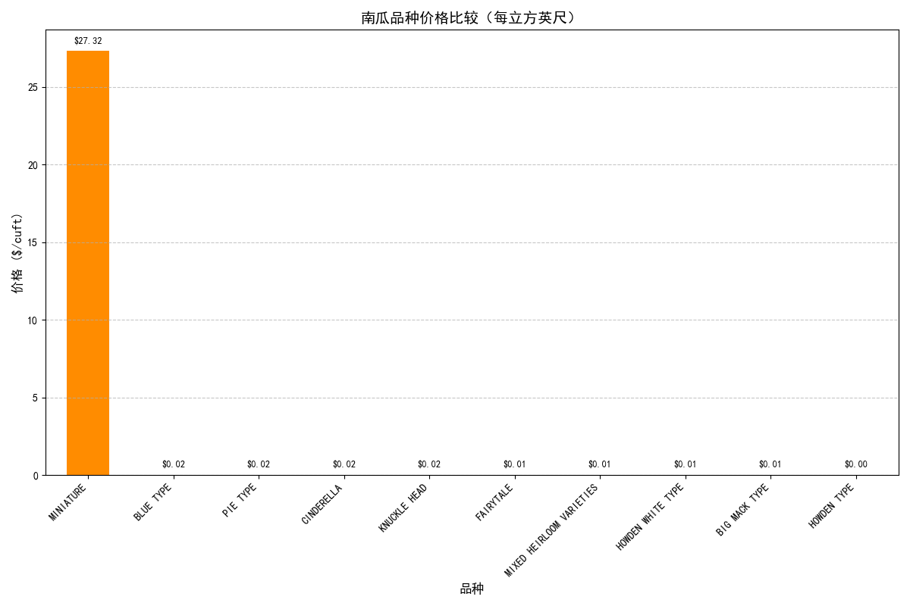
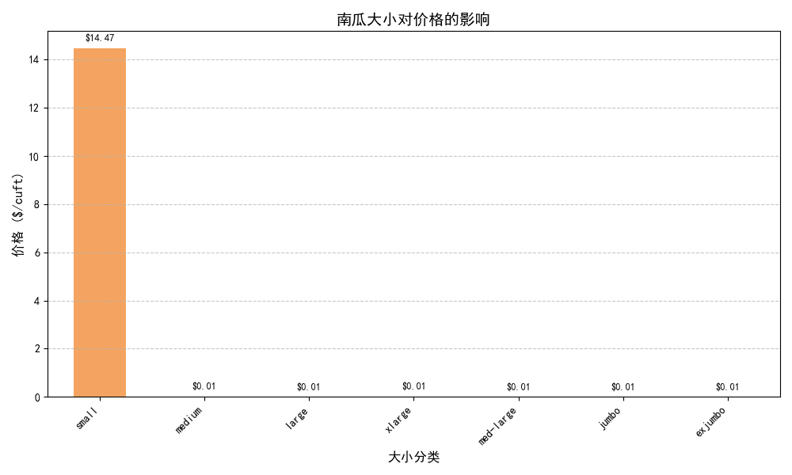
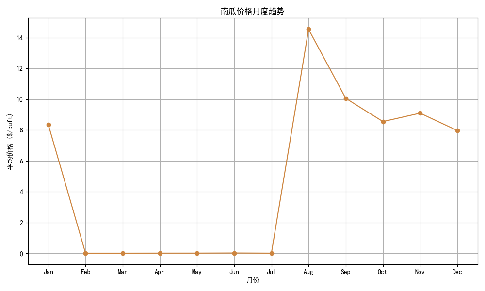
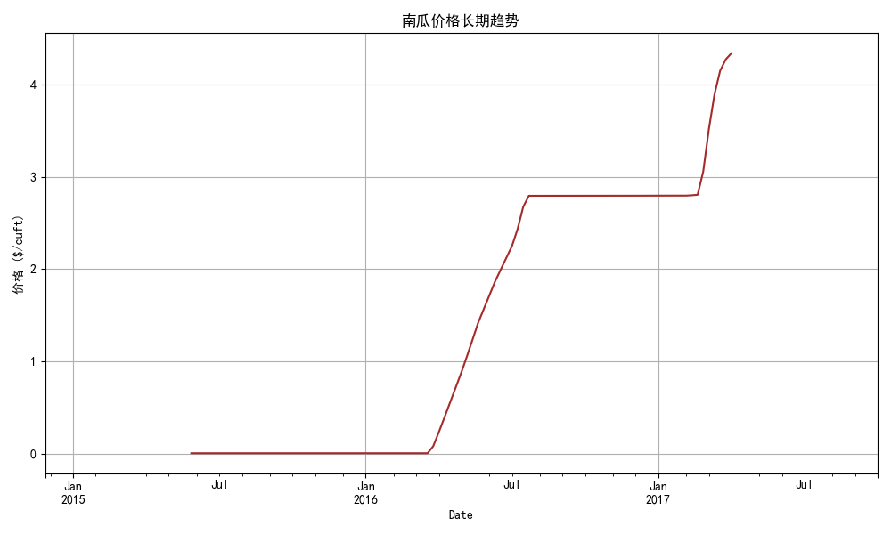
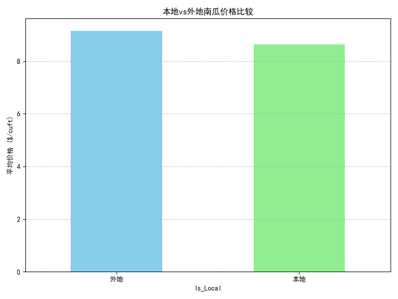
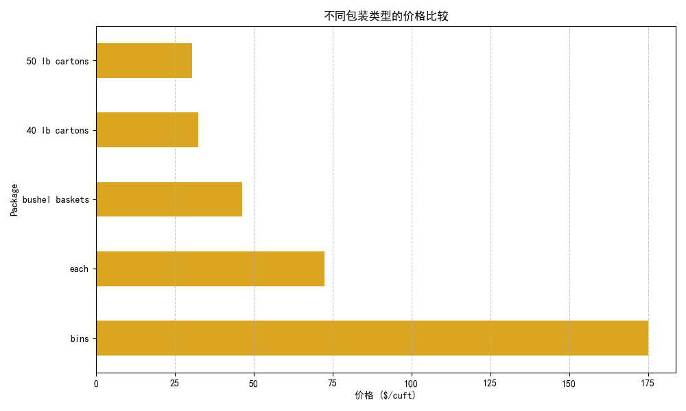
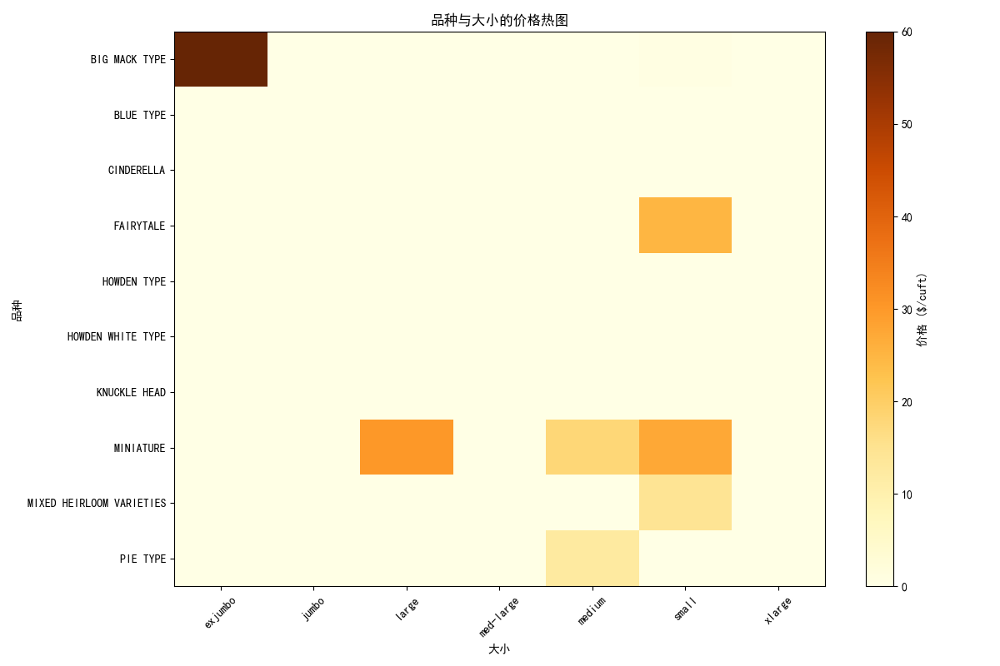
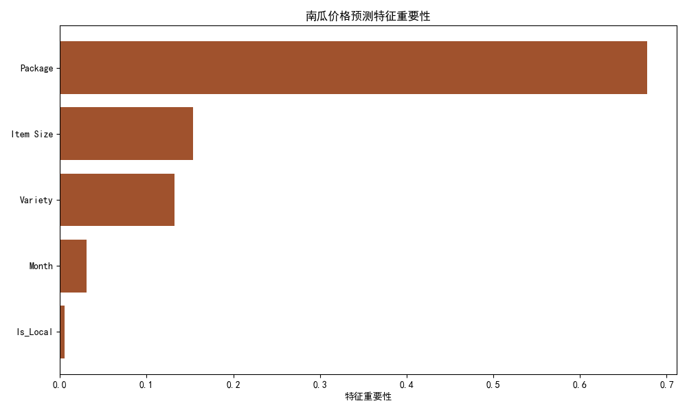
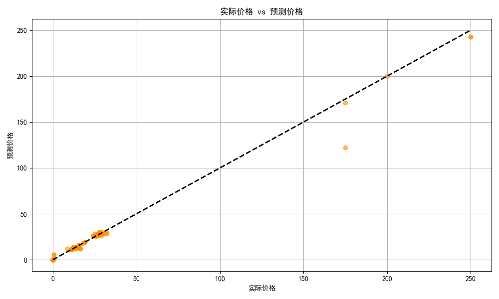

# 美国南瓜市场交易数据分析

## 一，数据描述
1.City Name: 南瓜交易发生的城市  

2.Type: 南瓜的类型

3.Package: 南瓜的包装单位或容器

4.Variety: 南瓜的品种

5.Sub Variety: 品种的子类。主要是 MINIATURE 品种下的 FLAT TYPE（扁平型）和 ROUND TYPE（圆型）

6.Grade: 南瓜等级

7.Date: 交易发生的日期（月/日/年），主要集中在2016年9月-12月和2017年9月

8.Low Price: 报告期内的最低交易价格（单位：美元）

9.High Price: 报告期内的最高交易价格（单位：美元）

10.Mostly Low: 报告期内最常见的低端交易价格（单位：美元）

11.Mostly High: 报告期内最常见的高端交易价格（单位：美元）

12.Origin: 南瓜的产地（州或国家）

13.Origin District: 产地区域，主要是加拿大产地会标注省份

14.Item Size: 南瓜的大小分级

15.Color: 南瓜颜色

16.Environment: 种植环境（如温室/露天）

17.Unit of Sale: 销售单位

其余几列所包含信息较少，忽略

## 二，研究结构
依次进行数据加载、清洗、特征工程、可视化分析、模型训练与评估。其中可视化工具使用matplotlib库

## 三，分析流程
### 1.数据加载与初步探索
加载数据：使用 pandas 的 read_csv 方法加载数据文件 US-pumpkins.csv。
初步探索： 打印数据的行数和列数，了解数据的整体规模。统计缺失值的数量，并按列排序，查看哪些列缺失值较多。

从运行结果可知，原始数据包含1757行和26列。在缺失值统计中，`Grade`、`Quality`、`Condition`、`Appearance`、`Storage`、`Crop`、`Trans Mode`、`Unnamed: 24`、`Environment` 和 `Type` 等列的缺失值数量与总行数相同，几乎全部缺失，表明这些列在数据集中几乎没有有效信息。此外，`Unnamed: 25`、`Origin District`、`Unit of Sale`、`Sub Variety` 和 `Color` 等列也存在大量缺失值。相比之下，`High Price`、`Package`、`City Name`、`Low Price`、`Date` 和 `Repack` 等列的缺失值较少或没有缺失值，而 `Variety` 和 `Origin` 列分别只有5个和3个缺失值。整体来看，数据集中许多列的缺失情况较为严重，需要进行适当的清洗和处理，以确保后续分析的有效性和准确性。

### 2.数据清洗
删除无关列：移除与分析目标无关的列，例如 Type、Grade、Sub Variety 等。  

日期格式转换：将 Date 列的字符串格式转换为 datetime 类型，便于后续的时间分析。

统一分类值格式：将 Item Size 列中的大小分类值统一为标准格式。  

处理异常价格值：通过计算四分位数和四分位距，去除 High Price 中的异常值。

### 3.特征工程
计算平均价格：将 Low Price 和 High Price 的平均值作为新的特征 Avg_Price。

提取时间特征：从 Date 列中提取年份、月份、周数和一年中的天数，分别作为 Year、Month、Week 和 DayOfYear。

创建本地标志：根据城市和产地的关系，判断南瓜是否为本地南瓜，生成 Is_Local 特征。

计算标准化价格：根据包装类型计算南瓜的体积，并进一步计算每立方英尺的价格 Price_per_cuft。

### 4.可视化分析
#### 4.1品种对价格的影响
统计每个品种的样本数量，筛选出样本数量大于 10 的品种。计算每个品种的 Price_per_cuft 中位数，并按价格从高到低排序。
使用条形图展示不同品种的价格差异。

#### 4.2大小对价格的影响
按 Item Size 分组，计算每种大小的 Price_per_cuft 中位数。
使用条形图展示不同大小分类的价格差异。

#### 4.3时间序列分析（月度）
按月份分组，计算每月的平均价格。
使用折线图展示南瓜价格的月度趋势。

#### 4.4季节性分解
将数据按周重采样，并计算每周的平均价格。
使用 seasonal_decompose 方法对时间序列进行季节性分解，提取趋势成分。
使用折线图展示南瓜价格的长期趋势。

#### 4.5本地与外地价格比较
按 Is_Local 分组，计算本地和外地南瓜的平均价格。
使用条形图比较本地和外地南瓜的价格差异。

#### 4.6包装类型价格分布
按包装类型分组，计算每种包装类型的 Price_per_cuft 中位数，并选择价格最高的前 5 种包装类型。
使用水平条形图展示不同包装类型的价格差异。

#### 4.7品种-大小交互热图
使用 pivot_table 创建一个品种和大小的交叉表，计算每个组合的 Price_per_cuft 中位数。
使用热图展示品种和大小之间的价格关系。

### 5.预测模型
选择用于建模的特征列（Variety、Item Size、Package、Month、Is_Local等）和目标变量 Price_per_cuft。
删除缺失值，确保数据完整性。

使用 LabelEncoder 对分类变量进行编码，将其转换为数值形式。

将数据集拆分为训练集和测试集，测试集占 20%。

使用 RandomForestRegressor 训练模型，设置 100 棵树。

使用均方根误差（RMSE）和 R² 值评估模型性能。
比较训练集和测试集的 RMSE 和 R² 值，检查模型是否存在过拟合。

提取模型的特征重要性，并使用水平条形图展示各个特征对价格预测的贡献。

绘制散点图，比较实际价格和预测价格的关系。
添加对角线，直观展示预测值与实际值的拟合程度。

### 6.结果
模型性能评估:  
RMSE: 3.25  
R²: 0.99

训练集表现: RMSE=2.05, R²=0.99  
测试集表现: RMSE=3.25, R²=0.99

## 四，Matplotlib特点
1.是基础绘图库，提供像素级控制能力，需要手动构建每个图表元素，适合创建高度定制化的图表。

2.直接处理原始数组，需要预先聚合数据，不支持DataFrame直接输入。

3.需手动实现多变量关系，复杂关系时需编写额外代码，多图层需要精细控制。

4.无内置统计功能，需要手动计算统计量，误差线等需额外编程。

5.需手动处理分类变量，类别排序需要额外代码，颜色映射需要手动设置。

6.默认样式较为基础，需要额外参数调整样式。

7.支持所有基础图表，但复杂图表需要大量代码，关系矩阵实现复杂。

8.需要更多代码行数，标准图表通常需要5-10行，完整配置可达20行以上。

